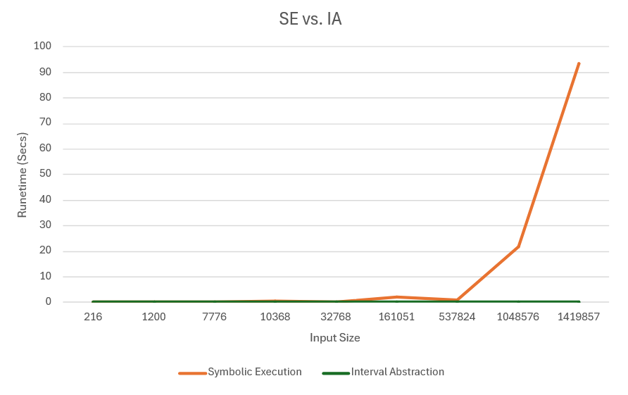

# README for se.py
Author: Michael Tran
Supported Systems: Python Version 3.11.9
Last Modified: 1/4/2024

# How to run the program:
- Unzip the folder "pa1-Tran.zip"
- Open a shell or Command Prompt and navigate into the folder "pa1-Tran"
- Type the command "python se.py"

# Part 1

Based on the graph of SE vs IA, it seems that IA runs in constant time whereas Symbolic Execution runs in at least polynomial time. SE executes in under a second for input size 537824 (14 inputs, 42 hidden nodes, and 14 outputs) and below, but the runtime quickly explodes after this point even for small increases in the number of nodes. By contrast, IA ran in under 1 thousandth of a second for all the input sizes tested (up to 100 nodes, not graphed). Clearly, IA scales much better than SE does for larger neural networks.

# Complete run of se.py
python se.py

Performing and solving Symbolic Execution on a randomly generated dnn:
[o2 = 27/5,
 n0_1 = 1922833/56555,
 n1_0 = 0,
 i0 = -11315/11311,
 n2_2 = 0,
 n1_2 = 1/2,
 n0_0 = 0,
 n1_3 = 0,
 o0 = 12/5,
 o1 = 141/10,
 n0_2 = 14147923/452440,
 i1 = 350607/45244,
 n2_1 = 0,
 n1_1 = 0,
 n2_0 = 0]
time to solve:  0.005000114440917969

Abstract Interval Domain test1()...
Simulating a concrete execution with fixed inputs: [i0 == 1, i1 == -1]
{'i0': [1, 1], 'i1': [-1, -1], 'n00': [2.0, 2.0], 'n01': [0, 0], 'n10': [1.0, 1.0], 'n11': [0, 0], 'o0': [1.0, 1.0], 'o1': [-1.0, -1.0]}

Simulating execution with precondition:  0.1 <= i0 <= 0.3, -0.7 <= i1 <= 0.0
{'i0': [0.1, 0.3], 'i1': [-0.7, 0.0], 'n00': [0.1, 1.0], 'n01': [0, 0.3], 'n10': [0, 0.5], 'n11': [0, 0], 'o0': [0.0, 0.5], 'o1': [-0.5, 0.0]}

Abstract Interval Domain test2() for DNN with 2 inputs, 12 hidden neurons, and 2 outputs...
Simulating a concrete execution with fixed inputs: [i0 == 1, i1 == -1]
{'i0': [1, 1], 'i1': [-1, -1], 'n00': [0.8, 0.8], 'n01': [0, 0], 'n02': [1.4, 1.4], 'n03': [0, 0], 'n10': [0, 0], 'n11': [1.98, 1.98], 'n12': [0, 0], 'n13': [0.6799999999999998, 0.6799999999999998], 'n20': [0, 0], 'n21': [2.202, 2.202], 'n22': [0, 0], 'n23': [0.7500000000000002, 0.7500000000000002], 'o0': [0.7202000000000002, 0.7202000000000002], 'o1': [0.9308000000000003, 0.9308000000000003]}

Simulating execution with precondition:  0.1 <= i0 <= 0.3, -0.7 <= i1 <= 0.0
{'i0': [0.1, 0.3], 'i1': [-0.7, 0.0], 'n00': [0.24000000000000002, 0.46], 'n01': [0.42000000000000004, 0.97], 'n02': [0, 0.29999999999999993], 'n03': [0.36, 0.59], 'n10': [0, 0], 'n11': [0.314, 0.835], 'n12': [0.19000000000000003, 0.6619999999999999], 'n13': [0, 0.4049999999999999], 'n20': [0, 0], 'n21': [0.0985000000000002, 1.2854999999999999], 'n22': [0.0353, 0.424], 'n23': [0, 0.7074999999999998], 'o0': [0.12505000000000005, 0.60449], 'o1': [-0.6394199999999999, 0.7760999999999998]}

# Followup questions
This assignment is not particularly difficult, but upon reflecting about the assignment I found that my understanding of SE is still a bit lacking. IA seems more straightforward by contrast.
My advice to other students would be to read the directions carefully. I attempted to use z3 to check the assertions from Part 2, but later realized the checks were supposed to be manual.

